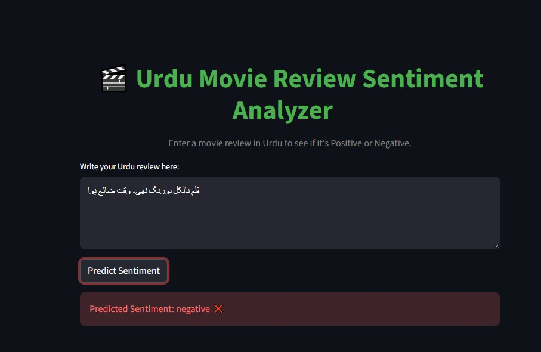
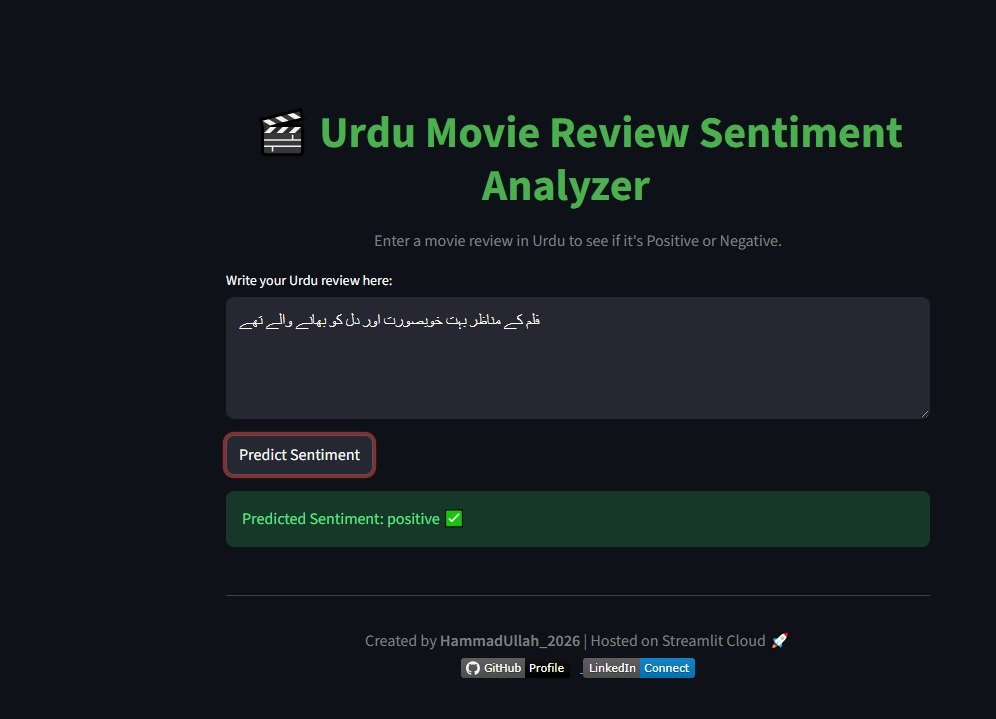

# 🎬 Urdu Movie Review Sentiment Analyzer  

  

---

🚀 **Live App:**  
https://urdu-sentiment-analyzer-kfr9buwwlm3hkjryqkhxsb.streamlit.app/

---

## 📌 Problem Statement

This project classifies Urdu movie reviews as **Positive** or **Negative** using Machine Learning and Natural Language Processing techniques.

---

## 📊 Model Performance Comparison

| Model | Performance | Remarks |
|--------|------------|----------|
| Support Vector Machine | ⭐ Highest | Best overall accuracy |
| Naive Bayes | Competitive | Fast & efficient |
| Decision Tree | Lower | Overfitting observed |
| Ensemble Model | Stable | Balanced results |

---

## 🧠 Project Workflow

1. Text Cleaning & Preprocessing  
2. TF-IDF Vectorization  
3. Model Training (SVM, NB, DT, Ensemble)  
4. Model Evaluation  
5. Deployment using Streamlit  

---

## 🖥 Application Preview

### 🔴 Negative Prediction

### 🟢 Positive Prediction

---

## 🛠 How to Run Locally

Clone repository:

git clone https://github.com/HAMMADULLAH18/Urdu-Sentiment-Analyzer

Install dependencies:

pip install -r requirements.txt

Run Streamlit app:

streamlit run app.py

---

## 👨‍💻 Author

Hammad Ullah  
BSAI Student | AI Engineer Journey 🚀

---

⭐ If you like this project, give it a star!

